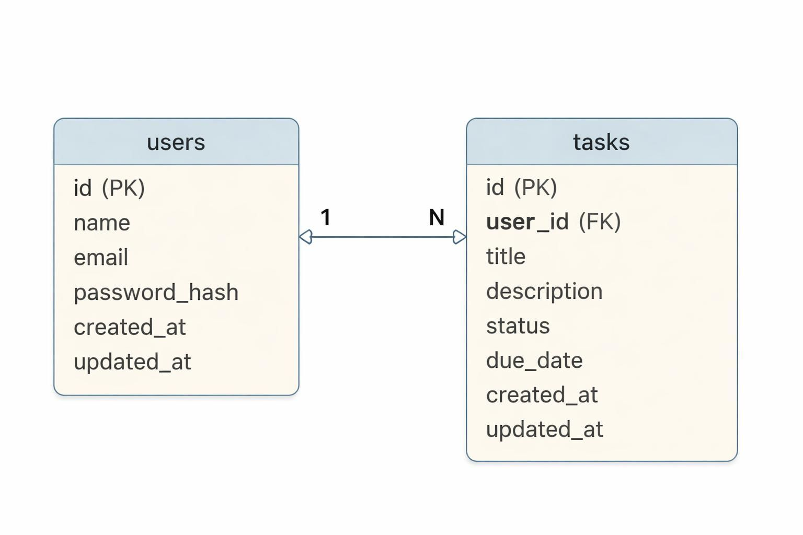
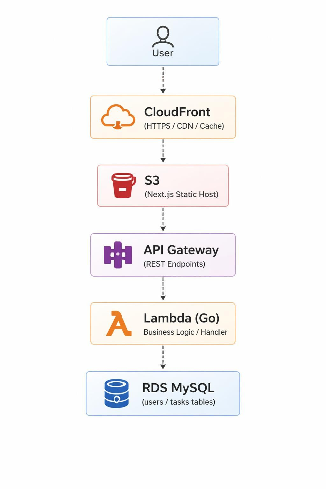

# 📌 タスク管理アプリ（ポートフォリオ）

このプロジェクトは Next.js × Go × AWS × Terraform × RDS(MySQL) を用いて構築した、
フルスタック構成のタスク管理 Web アプリです。

フロントエンド・バックエンド・インフラをすべて自前で設計・実装し、
AWS 上で本番運用可能な構成を Terraform により IaC 化しています。

また、Go バックエンドでは layered architecture を採用し、

* Handler
* Service
* Repository

を分離することで責務分離・保守性・テスタビリティを意識した設計を行っています。

---

# 🏗 アーキテクチャ図



---

# 🗄 ER 図



---

# 🟦 技術スタック（Tech Stack）

## フロントエンド

* Next.js（App Router）
* TypeScript
* React
* Tailwind CSS

## バックエンド

* Go（標準ライブラリ中心）
* AWS Lambda（Go Runtime）
* API Gateway（HTTP API）
* Swagger（OpenAPI）

## インフラ（AWS）

* VPC
* RDS for MySQL
* Lambda（VPC 内接続）
* API Gateway
* Cognito
* S3
* CloudFront
* IAM
* Terraform（IaC）

## その他

* Docker
* Git / GitHub
* GitHub Actions（CI/CD）

---

# 🟩 アプリ概要

## 機能一覧

### 認証

* Cognito 認証
* JWT 認証 Middleware

### タスク管理

* タスク CRUD
* ステータス管理（TODO / DOING / DONE）
* ユーザーごとのタスク管理
* ページネーション対応

### API

* REST API
* OpenAPI / Swagger ドキュメント
* DTO ベースの Request 管理
* strict JSON decode
* validation 対応

---

# 🟧 AWS アーキテクチャ

```text
Next.js (S3 + CloudFront)
        ↓
API Gateway（JWT 認証）
        ↓
Lambda（Go）
        ↓
RDS MySQL（Private Subnet）
```

---

# 🔐 セキュアな構成

RDS を安全に利用するため、以下の構成を採用しています。

* VPC（/16）
* パブリックサブネット × 2
* プライベートサブネット × 2（RDS 用）
* Internet Gateway
* Security Group
* Lambda → RDS のみ接続許可
* RDS は Private Subnet に配置

---

# 🟨 バックエンド設計

バックエンドは layered architecture を採用しています。

```text
Handler
  ↓
Service
  ↓
Repository
  ↓
MySQL
```

## 設計で意識した点

* 責務分離
* DTO による API 入出力分離
* Repository Interface による DI 対応
* strict JSON decode
* Middleware Chain
* Graceful Shutdown
* DB Connection Pool 最適化

---

# 📂 リポジトリ構成

```text
portfolio/
├── frontend/
├── backend/
├── infra/
├── docs/
└── scripts/
```

---

# 🗄 DB 設計（Database Design）

RDS MySQL を利用し、
データ整合性・検索性能を意識したテーブル設計を行っています。

## 設計で意識した点

* users.email に UNIQUE 制約を設定
* tasks.user_id に外部キー制約を設定
* ON DELETE CASCADE による整合性維持
* tasks.status に INDEX を付与
* tasks.user_id に INDEX を付与
* ENUM による status 制御
* created_at / updated_at の DB 自動管理

---

# 🧩 Migration 管理

DB schema は migration SQL により管理しています。

```text
backend/
└── migrations/
    ├── 001_create_users.up.sql
    ├── 001_create_users.down.sql
    ├── 002_create_tasks.up.sql
    └── 002_create_tasks.down.sql
```

---

# 📚 Swagger / OpenAPI

Swagger UI:

```text
http://localhost:8080/api/v1/docs/
```

OpenAPI schema:

```text
backend/swagger/swagger.yml
```

---

# 🚀 ローカル開発

## 起動

```bash
make run
```

## Migration 実行

```bash
make migrate-up
```

---

# 🧪 API 機能

## ページネーション

```http
GET /api/v1/tasks?limit=20&offset=0
```

## Validation

* strict JSON decode
* unknown field rejection
* request size 制限
* DTO ベース validation

---

# 🔄 Middleware

Middleware Chain により以下を実装しています。

* Logging
* CORS
* JWT Authentication
* Request Logging

---

# ⚡ パフォーマンス・運用面

* Lambda cold start を考慮した DB 初期化
* Connection Pool 最適化
* Graceful Shutdown
* Context timeout 対応
* Pagination による負荷軽減

---

# 🚀 CI/CD

GitHub Actions による自動デプロイ。

## Frontend

* S3 + CloudFront へ deploy

## Backend

* Lambda へ deploy

## Infrastructure

* Terraform apply

---

# 🧠 工夫した点

* Terraform による AWS IaC 化
* Cognito JWT 認証構成
* OpenAPI ベース API 設計
* Layered Architecture 採用
* Repository Interface による DI 対応
* Middleware Chain 導入
* Docker ベース開発環境
* Migration による DB schema 管理
* Graceful Shutdown 実装
* strict JSON decode による API 安全性向上

---

# 🔧 今後の改善点

* JWT 検証本実装（JWKS / RS256）
* Unit Test / Mock Repository
* E2E テスト（Playwright）
* OpenAPI 自動生成
* タスク検索・フィルタリング
* Redis cache
* 非同期 Job Queue
* ダークモード
* 通知機能
* Monitoring / Observability
