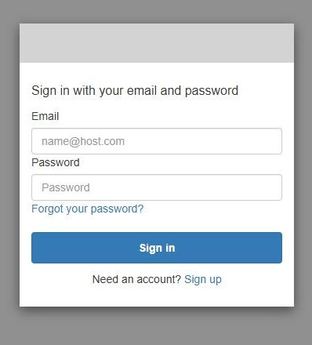
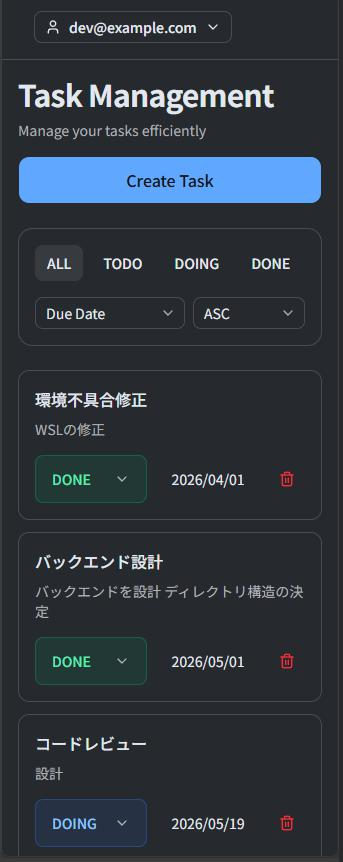

# 📌 Cloud-Native Task Management App

Go、Next.js、AWSを用いて設計・実装したクラウドネイティブなタスク管理アプリケーションです。認証・認可、Infrastructure as Code、CI/CDを含むモダンなクラウドアーキテクチャを採用し、実践的なWebサービス開発を意識して構築しました。

---

## 🌍 Live Demo

| Service | URL |
| --- | --- |
| Frontend | https://dgw03czfpoc25.cloudfront.net |
| Swagger UI | https://h5kvlgfwv1.execute-api.ap-northeast-1.amazonaws.com/api/docs |

> ※ サインアップ時、確認メールが届かない場合は、迷惑メールフォルダもご確認ください。

---

# ✨ Features

- Goによるレイヤードアーキテクチャ（Handler / Service / Repository）
- Terraformによるインフラのコード化（IaC）
- CloudFront + S3によるフロントエンドホスティング
- JWT認証（AWS Cognito + API Gateway Authorizer）
- Owner Isolationによるマルチユーザー対応
- Task CRUD API（タスクの作成・更新・削除・取得）
- CI/CD with GitHub Actions

---

<p align="center">
  
</p>


### Task Dialog

<p align="center">
  
</p>

### Task List

<p align="center">
  
</p>


### Login (AWS Cognito Hosted UI)  &  Mobile

<div style="display:flex; justify-content:center; gap:10px;">
  

  
</div>


---


# 🧩 Tech Stack

| Layer | Technology |
| --- | --- |
| Frontend | Next.js + TypeScript |
| Backend | Go |
| Infrastructure | Terraform |
| Authentication | AWS Cognito |
| API | API Gateway HTTP API |
| Runtime | AWS Lambda |
| Database | MySQL (RDS) |
| Hosting | S3 + CloudFront |

---

# 🏛 Architecture Decisions

本プロジェクトでは、サーバーレスアーキテクチャを採用し、運用負荷の軽減と保守性向上を目指しました。

- AWS Lambda: サーバー管理を不要にし、運用負荷を削減
- API Gateway: 認証およびルーティングをアプリケーションから分離
- AWS Cognito: セキュアな認証基盤を構築
- Terraform: Infrastructure as Codeによる再現性の高いインフラ管理を実現

---


# 🔐 Authentication

AWS Cognito Hosted UI を利用した JWT 認証を採用しています。

```text
Cognito Hosted UI
  ↓
JWT Token
  ↓
API Gateway JWT Authorizer
  ↓
Lambda
```

特徴:

- JWTベース認証
- API Gatewayによる認証分離
- Owner Isolation による認可制御

---

# 🧱 Backend Architecture

```text
  API Gateway
      ↓
   Lambda
      ↓
   Handler
      ↓
   Service
      ↓
 Repository
      ↓
   RDS MySQL
```

特徴:

- Context Timeout
- Structured Logging
- Owner Isolation
- Strict JSON Validation

---

# 🎨 Frontend

- Next.js (App Router)
- TypeScript
- React Query
- Zustand
- shadcn/ui

---

# 🔒 Security

- Cognito Authentication
- API Gateway JWT Authorizer
- Owner Isolation
- Private RDS (No Public Access)
- SQL Timeout
- Request Timeout
- Panic Recovery
- Body Size Limitation
- Security Group-based Access Control

---

# ⚙ CI/CD

- GitHub Actions CI
- Go Test / Go Vet
- Pull Request Validation
- Lambda Build & Deploy

Testing:
- Service Layer Unit Test Coverage: 98%

---

# 🏗 Infrastructure

Terraform により構築:

- VPC
- Public / Private Subnets
- Security Groups
- RDS MySQL
- Lambda
- API Gateway HTTP API
- Cognito User Pool
- S3 + CloudFront
- Bastion EC2

---

# 🛠 Challenges & Solutions

### Secure Authentication

課題:
認証ロジックをアプリケーションコードへ直接実装すると責務が肥大化する

解決:
Cognito Hosted UI + API Gateway JWT Authorizer を採用し認証処理を分離

### Database Access Control

課題:
RDSへの不要なアクセス経路を排除し、
データベースへの接続元を限定したい

解決:
Private Subnet上にRDSを配置し、
Security GroupによってLambdaおよびBastion Hostからのみアクセスを許可

---


# 🚧 Engineering Background

情報システム部門での業務経験を基盤に、
認証・認可、Infrastructure as Code、CI/CDを含む
実践的なクラウドネイティブアーキテクチャの設計・実装経験を得ることを目的として構築した個人開発プロジェクトです。
- 基本情報技術者 / 応用情報技術者 取得
- 情報システム部門での業務経験（約1.5年）
  - VBAによる業務改善ツール開発
  - AS400の運用・保守

---
