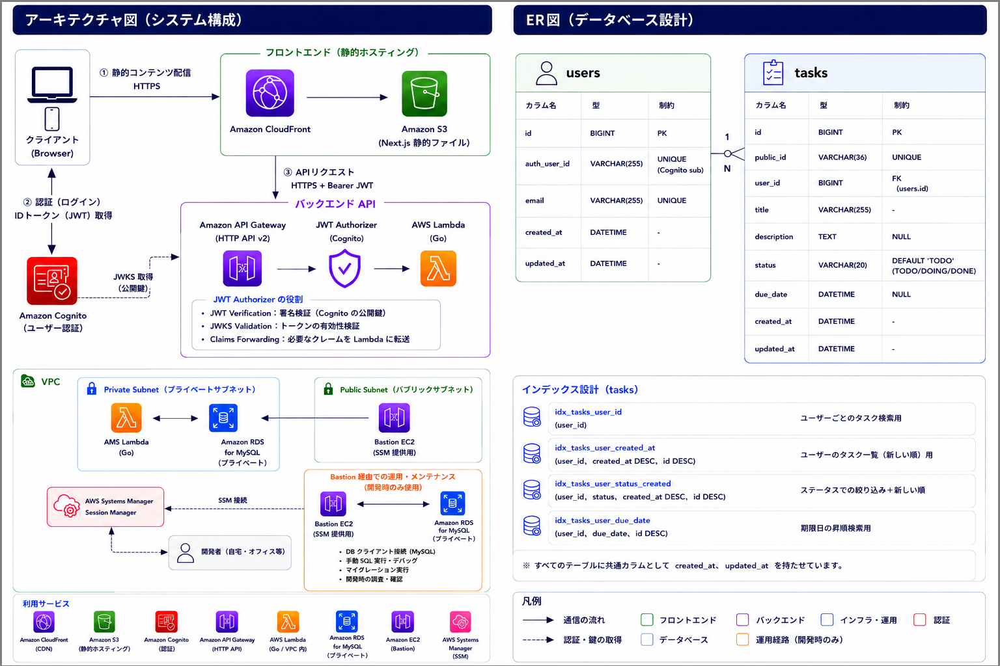
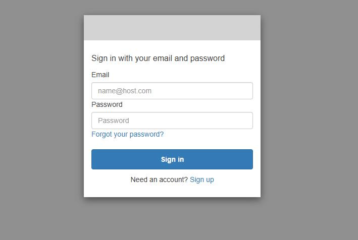
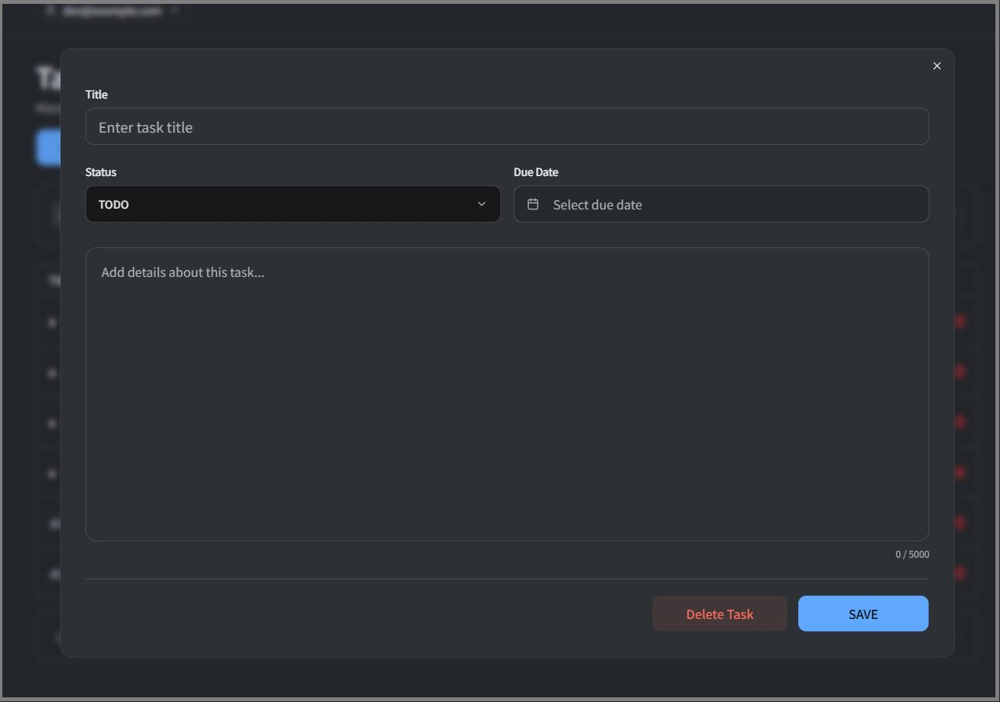
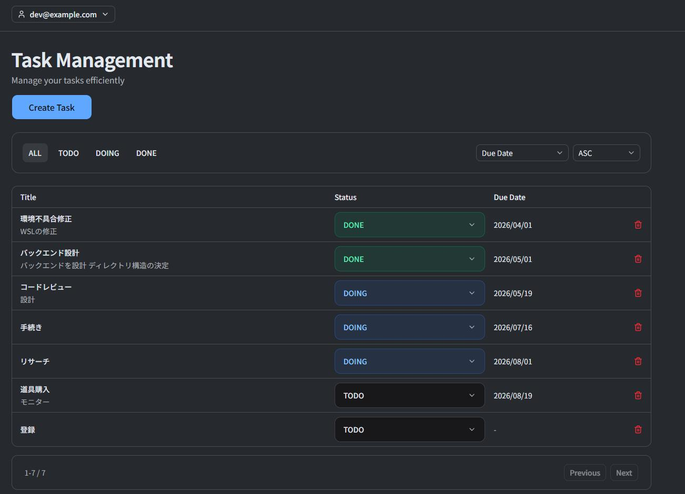

# 📌 Serverless Task Management App

Go、Next.js、AWSを用いて設計・実装したサーバーレスなタスク管理アプリケーションです。認証・認可、Infrastructure as Code、CI/CDを含むモダンなクラウドアーキテクチャを採用し、実践的なWebサービス開発を意識して構築しました。

---

## 🌍 Live Demo

| Service | URL |
| --- | --- |
| Frontend | https://dgw03czfpoc25.cloudfront.net |
| Swagger UI | https://h5kvlgfwv1.execute-api.ap-northeast-1.amazonaws.com/api/docs |

---

# ✨ Features

- Goによるレイヤードアーキテクチャ（Handler / Service / Repository）
- Terraformによるインフラのコード化（IaC）
- CloudFront + S3によるフロントエンドホスティング
- JWT認証（AWS Cognito + API Gateway Authorizer）
- Owner Isolationによるマルチユーザー対応
- Task CRUD API（タスクの作成・更新・削除・取得）
- CI/CD with GitHub Actions

---

<p align="center">
  
</p>

### Login (AWS Cognito Hosted UI)

<p align="center">
  
</p>

### Task Dialog

<p align="center">
  
</p>

### Task List

<p align="center">
  
</p>

---


# 🧩 Tech Stack

| Layer | Technology |
| --- | --- |
| Frontend | Next.js + TypeScript |
| Backend | Go |
| Infrastructure | Terraform |
| Authentication | AWS Cognito |
| API | API Gateway HTTP API |
| Runtime | AWS Lambda |
| Database | MySQL (RDS) |
| Hosting | S3 + CloudFront |

---

# 🔐 Authentication

AWS Cognito Hosted UI を利用した JWT 認証を採用しています。

```text
Cognito Hosted UI
  ↓
JWT Token
  ↓
API Gateway JWT Authorizer
  ↓
Lambda
```

特徴:

- JWTベース認証
- API Gatewayによる認証分離
- Owner Isolation による認可制御

---

# 🧱 Backend Architecture

```text
  API Gateway
      ↓
   Lambda
      ↓
   Handler
      ↓
   Service
      ↓
 Repository
      ↓
   RDS MySQL
```

特徴:

- Context Timeout
- Structured Logging
- Owner Isolation
- Strict JSON Validation

---

# 🎨 Frontend

- Next.js (App Router)
- TypeScript
- React Query
- Zustand
- shadcn/ui

---

# 🔒 Security

- Cognito Authentication
- API Gateway JWT Authorizer
- Owner Isolation
- Private RDS (No Public Access)
- SQL Timeout
- Request Timeout
- Panic Recovery
- IMDSv2 Required
- Body Size Limitation

---

# ⚙ CI/CD

- GitHub Actions CI
- Go Test / Go Vet
- Lambda Build & Deploy
- Pull Request Validation

---

# 🏗 Infrastructure

Terraform により構築:

- VPC
- Public / Private Subnets
- Security Groups
- RDS MySQL
- Lambda
- API Gateway HTTP API
- Cognito User Pool
- S3 + CloudFront
- Bastion EC2

---

# 💡 Design Highlights

- AWSフルマネージド構成によるサーバーレス設計
- 認証と認可の分離（Cognito + API Gateway）
- Public ID によるセキュリティ強化
- Lambda + RDS のシンプルな構成設計
- Terraform による完全な IaC 管理

---

# 🚧 Engineering Background

情報システム部門での業務経験を基盤に、
Go・AWS・Terraformを用いたクラウドネイティブなアプリケーション開発へ挑戦するために構築した個人開発プロジェクトです。
- 情報システム部門での業務経験（約1.5年）
  - VBAによる業務改善ツール開発
  - AS400の運用・保守
- 基本情報技術者 / 応用情報技術者 取得

---
